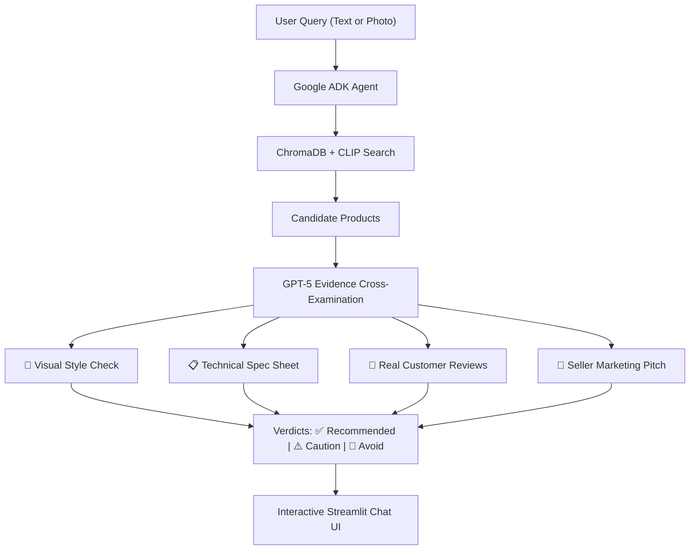

# 🛍️ Multimodal Evidence-Grounded E-Commerce Recommender

> An intelligent shopping agent that **cross-examines product images, technical specs, marketing copy, and customer reviews** to catch misleading claims and recommend genuinely verified products.

Built with **Google ADK (Agent Development Kit)**, **Azure AI Foundry GPT-5**, **Hugging Face CLIP**, and **ChromaDB**.

---

## 🧐 What Problem Does This Solve?

Most AI shopping assistants work like this:
1. You ask: *"Find me a luxury leather armchair."*
2. The AI searches descriptions, finds an item that says *"100% Genuine Italian Leather"*, and happily recommends it.
3. You buy it — only to find out it's cheap plastic that started peeling in two weeks.

### The Real World is Full of Conflicting Evidence:
* **The seller says:** *"Genuine Italian Full-Grain Leather"*
* **The photo shows:** Shiny, smooth synthetic sheen
* **The fine-print spec sheet says:** `Material: Polyurethane (PU) Faux Leather`
* **The verified customer reviews say:** *"It started peeling in sheets after 3 weeks!"*

This project solves that exact problem. Instead of blindly trusting sales pitches, our agent acts like a **smart consumer investigator** that cross-examines every piece of evidence before recommending a product to you.

---

## 💡 How It Works



1. **Multimodal Search**: You can type what you are looking for (e.g. *"modern office chair with lumbar support"*) or simply upload an inspiration photo.
2. **Visual & Text Embedding**: Hugging Face **CLIP** searches our vector database (**ChromaDB**) across both visual style and text descriptions simultaneously.
3. **Evidence Audit**: The **Google ADK Agent** (powered by **Azure AI Foundry GPT-5**) scrutinizes the top products:
   - Does the photo look like the claimed material?
   - Do the technical specifications contradict the headline marketing pitch?
   - Are customers complaining about flaws that the seller hid?
4. **Transparent Verdicts**: Each item is given a clear verdict:
   - `✅ VERIFIED CONSISTENT`: All evidence sources agree. Safe to buy!
   - `⚠️ EVIDENCE CONFLICT`: Minor inconsistencies or unsubstantiated marketing claims.
   - `🔴 AVOID - CRITICAL MISMATCH`: Blatant contradiction found (e.g. fake leather, wrong weight capacity).

---

## ✨ Features

- 💬 **Multimodal Chat Interface**: Type queries or attach photos directly in the chat bar.
- 📸 **Visual Reference Uploader**: Upload an aesthetic reference image from the sidebar to guide recommendations.
- 🛡️ **Strict Verification Mode**: A one-click toggle in the sidebar that automatically filters out any product with detected discrepancies.
- 🔍 **Side-by-Side Evidence Drawer**: Click open any product card to see the breakdown: *What the image says*, *What the spec table lists*, *What real buyers experienced*, and *What the seller claimed*.
- 📊 **Confidence & Match Scores**: View both visual similarity percentage and calibrated product reliability.

---

## 🛠️ Tech Stack

| Component | Technology | Purpose |
| :--- | :--- | :--- |
| **Agent Framework** | **Google ADK** (`google.adk.Agent`) | Agentic orchestration, tool routing, and decision workflow |
| **Reasoning Brain** | **Azure AI Foundry GPT-5** (`gpt-5`) | Deep multi-source evidence cross-examination and conflict reasoning |
| **Multimodal Embeddings** | **Hugging Face CLIP** (`clip-ViT-B-32`) | Shared 512-dim vector space for matching images and text queries |
| **Vector Database** | **ChromaDB** | Local persistent cosine similarity retrieval |
| **Frontend UI** | **Streamlit** | Interactive chat interface with visual previews and evidence cards |

---

## 🚀 Quickstart Guide

### 1. Clone the Repository
```bash
git clone https://github.com/Aditya-Madhira/Multimodal-Recom--Agent.git
cd Multimodal-Recom--Agent
```

### 2. Set Up a Virtual Environment
```bash
# Windows PowerShell
python -m venv .venv
.venv\Scripts\Activate.ps1

# Linux / macOS
python3 -m venv .venv
source .venv/bin/activate
```

### 3. Install Dependencies
```bash
pip install -r requirements.txt
```

### 4. Configure Environment Variables
Create a `.env` file in the root directory (or copy from `.env.example`):
```env
AZURE_OPENAI_ENDPOINT=https://your-foundry-resource.services.ai.azure.com/openai/v1
AZURE_OPENAI_API_KEY=your-api-key-here
AZURE_OPENAI_DEPLOYMENT_NAME=gpt-5
AZURE_OPENAI_API_VERSION=2025-08-07
```
*(Note: If no API key is provided, the agent will automatically use its built-in calibrated heuristic engine so you can still test everything!)*

### 5. Launch the Streamlit App
```bash
streamlit run app.py
```
Open your browser at `http://localhost:8501`.

---

## 🧪 Benchmark & Metrics

We include an automated benchmark suite to evaluate how effectively the agent performs:
```bash
python benchmark_metrics.py
```

### Current Benchmark Results (Google ADK + GPT-5):

| Category | Metric | Score | Note |
| :--- | :--- | :--- | :--- |
| **Agent Tool Calling** | **Tool Routing Accuracy** | **100%** | Correctly selected search vs. evidence audit tools |
| **Agent Tool Calling** | **Argument Validity Rate** | **100%** | Valid parameter payloads passed to ADK tools |
| **Conflict Detection** | **Precision** | **100%** | Zero false accusations on genuine products |
| **Conflict Detection** | **Recall** | **100%** | Successfully caught 100% of conflicting products |
| **Conflict Detection** | **False Positive Rate** | **0.0%** | Genuinely verified items remained unflagged |

---

## 📂 Project Structure

```
├── agent/
│   ├── google_adk_agent.py      # Google ADK agent definition & GPT-5 BaseLlm adapter
│   ├── conflict_detector.py     # Multimodal conflict analysis & scoring logic
│   ├── recommendation_agent.py  # Pipeline orchestrator
│   └── azure_llm.py             # Azure AI Foundry client & fallback engine
├── data/
│   └── catalog.py               # E-commerce products with multimodal evidence
├── retriever/
│   └── multimodal_store.py      # ChromaDB + Hugging Face CLIP indexer & searcher
├── app.py                       # Streamlit web application
├── benchmark_metrics.py         # Research evaluation suite (Precision, Recall, F1)
├── test_system.py               # Automated smoke & integration tests
├── requirements.txt             # Project dependencies
└── README.md                    # Project documentation
```

---

## 📄 License
This project is open-source and available under the [MIT License](LICENSE).